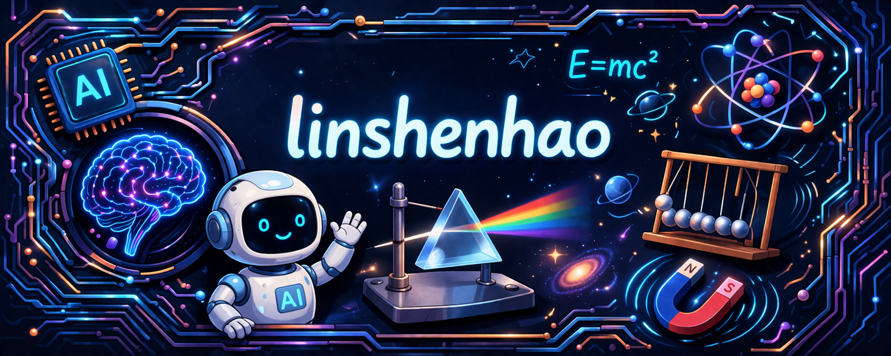

# 👉🏻 **Lin Shen Hao Stefano** 👈🏻

 `BSc in Physics` | `MSc in Data Science`

---

Hello! I'm Lin Shen Hao Stefano, a passionate **Physics, AI, Machine Learning, Deep Learning, and Computer/Data Vision** enthusiast with a solid foundation in **Physics and Data Science**. I thrive on working on innovative projects.

---

## 🔥 **Current Position**
Data Science Master degree student

---

## 🛠 **Tech Stack & Tools**

  

---

## 📖 **Publications**

coming soon

---
